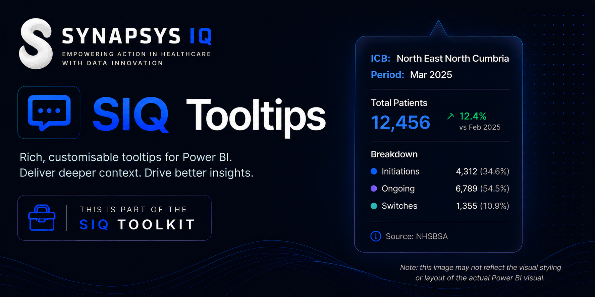

# SIQ Better Tooltips - Power BI Custom Visual

**SIQ Better Tooltips** is a professional custom visual designed for Microsoft Power BI reports, published by **SynapsysIQ**. It lets report authors place a compact hover/click trigger (such as an info icon, text label, or invisible block) on the canvas that displays a rich Markdown-styled tooltip on hover or click. 

---

## Core Features

- **Rich Markdown Rendering**: Full support for Headings (`#`), Bold (`**`), Italics (`*`), Bullet/Numbered Lists, Blockquotes, Hyperlinks, inline/fenced Code, Images, GIFs, and Tables.
- **Built-in Sanitization**: Integrates a client-side HTML sanitization engine that uses `DOMParser` to strip scripts, event listeners (`on*`), iframes, and `javascript:` URIs to protect against XSS injection.
- **Diverse Trigger Configurations**:
  - `Icon`: Renders a custom Unicode symbol (default: `ℹ`).
  - `Text`: Renders a custom text label (default: `Details`).
  - `Icon + Text`: Renders a side-by-side combination.
  - `Transparent Block`: Invisible hover/click hit region (shows a dashed helper outline in Edit Mode).
- **Smooth Animations**: High-performance CSS transitions (Fade, Slide, Scale) with custom durations (in ms).
- **Smart Positioning**: Automatically calculates and flips tooltip placement (Top, Bottom, Left, Right) to avoid viewport boundaries.
- **Link Interception**: Redirects clicked Markdown links to the secure Power BI `host.launchUrl(url)` API.
- **Accessibility**: Support for keyboard Tab focus, activation keys (Enter/Space), Escape-to-close, screen reader ARIA roles, and High Contrast theme compatibility.

---

## Sizing & Layout Modes (Handling Iframe Constraints)

Power BI custom visuals are sandboxed inside browser `<iframe>` containers. To display tooltips that extend beyond a small trigger icon without clipping or blocking underlying canvas visuals, choose one of these design patterns:

### Mode A: Transparent Canvas Mode (Recommended)
1. Resize the visual container to a large area (e.g. $300 \times 250\text{ px}$ or larger). The background is 100% transparent.
2. Position the trigger icon in one corner of the container. 
3. *Edit Mode* shows a blue dashed border outline for positioning. *View Mode* removes all borders.
4. Transparent regions inside the container ignore pointer events so background charts remain interactive.

### Mode B: Compact Mode
1. Sized exactly to the width and height of the trigger + expanded tooltip panel (e.g. $250 \times 150\text{ px}$).
2. The tooltip is bounded and scrollable within the visual's viewport.

### Mode C: Native Tooltip Fallback (Tiny Container, Non-Blocking)
1. Set the visual container to match only the trigger size (e.g. $24 \times 24\text{ px}$).
2. Go to **Format pane** -> **Tooltip Settings** -> toggle **Use native Power BI tooltip** to **On**.
3. Hovering over the icon will display the Markdown content (with syntax tags like `#` and `**` automatically stripped to clean plain text) as a standard Power BI native tooltip that floats outside the visual container.
4. *Optionally*, bind a DAX measure to the **Tooltip Measure** data field to drive this native tooltip dynamically.

---

## Creating Dynamic DAX Markdown Measures

If you bind a DAX measure to the **Tooltip Measure** field, the visual evaluates it dynamically. Use `&` to concatenate strings and `UNICHAR(10)` to insert newlines.

### Example 1: Dynamic KPI Status
```dax
SIQ Dynamic Tooltip = 
VAR TotalSales = [Total Sales]
VAR Target = [Sales Target]
VAR Variance = TotalSales - Target
VAR StatusColor = IF(Variance >= 0, "**On Track** 🟢", "**Action Required** 🔴")
RETURN
    "# Regional Sales Report" & UNICHAR(10) &
    "Detailed metrics for the selected time period:" & UNICHAR(10) & UNICHAR(10) &
    "- **Sales**: " & FORMAT(TotalSales, "$#,##0") & UNICHAR(10) &
    "- **Target**: " & FORMAT(Target, "$#,##0") & UNICHAR(10) &
    "- **Status**: " & StatusColor & UNICHAR(10) & UNICHAR(10) &
    "### Breakdown" & UNICHAR(10) &
    "| Metric | Value |" & UNICHAR(10) &
    "|---|---|" & UNICHAR(10) &
    "| Sales Variance | " & FORMAT(Variance, "$#,##0;($#,##0);-") & " |"
```

### Example 2: Dynamic Product Detail Card
```dax
Product Tooltip Detail = 
VAR ProductName = SELECTEDVALUE(Products[ProductName], "Select a Product")
VAR Description = SELECTEDVALUE(Products[Description], "No description available.")
VAR ImageUrl = SELECTEDVALUE(Products[ImageUrl], "https://via.placeholder.com/150")
RETURN
    "## " & ProductName & UNICHAR(10) &
    Description & UNICHAR(10) & UNICHAR(10) &
    ""
```

---

## Formatting Pane Options

### Trigger Settings
- **Trigger Type**: `Icon`, `Text`, `Icon + Text`, or `Transparent Block`.
- **Trigger Text**: Text content for labels (default: "Details").
- **Icon Symbol**: Unicode character (default: `ℹ`).
- **Icon/Text Size**: Font size of the trigger in pixels (default: `16px`).
- **Color Settings**: Customize foreground, background, and solid borders.

### Tooltip Settings
- **Markdown Content**: Enter static Markdown text.
- **Use Native Tooltip**: Toggles between HTML custom panel (Off) or native floating tooltip (On).
- **Width / Max Height**: Adjust the tooltip panel size. Taller content will show a custom scrollbar.
- **Colors**: Separate pickers for background, text, and border colors.
- **Border Radius**: Roundness of tooltip corners in pixels.
- **Shadow**: Toggles soft drop shadows.
- **Typography**: Change font family and font size.
- **Padding**: Internal padding around tooltip text in pixels.
- **Placement**: Select `Auto`, `Top`, `Right`, `Bottom`, or `Left`.
- **Offsets**: Configure X/Y distance from the trigger.
- **Show Close Button**: Render an `×` close button (for click trigger mode).
- **Open Behavior**: Open on `Hover` or `Click`.
- **Animations**: Transition types (`None`, `Fade`, `Slide`, `Scale`) and custom durations.
